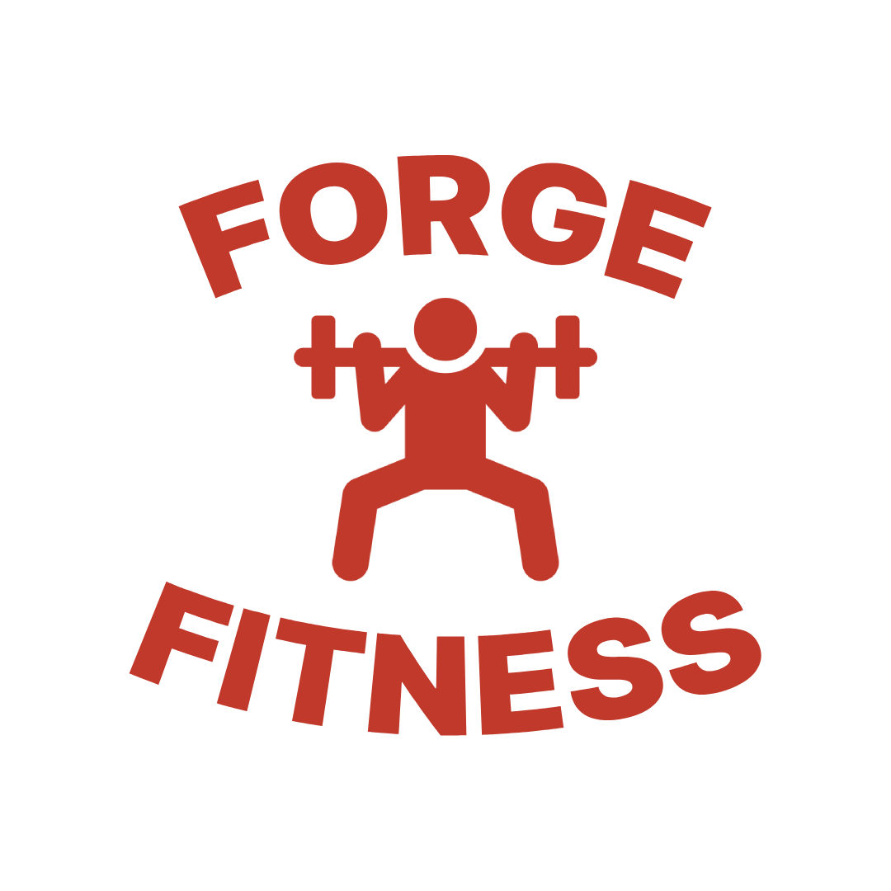
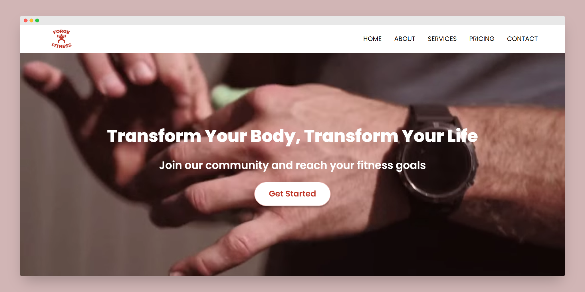
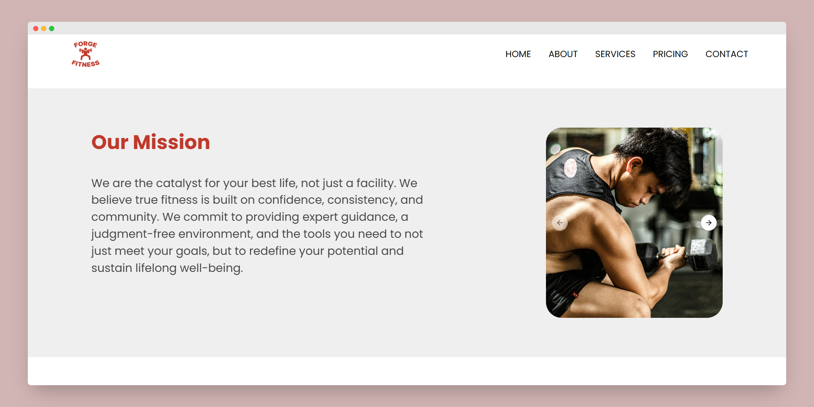
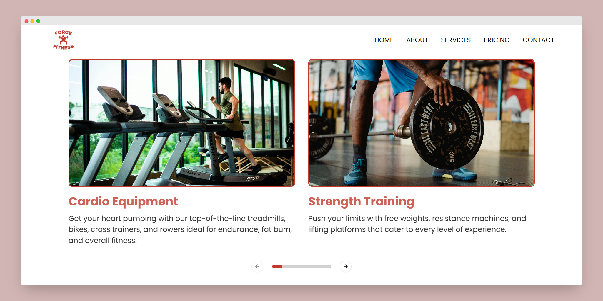
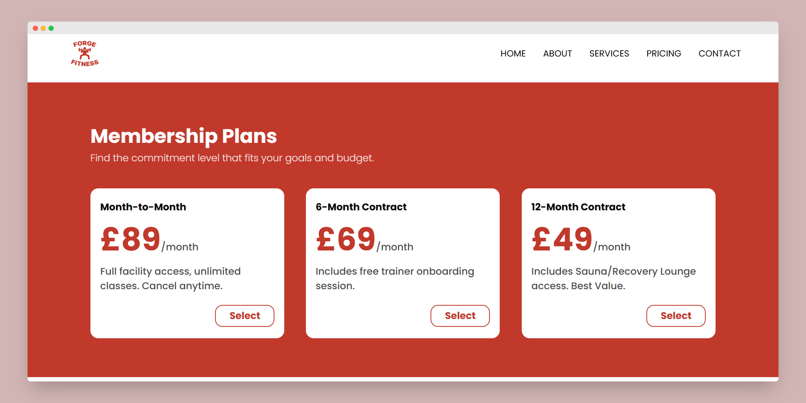
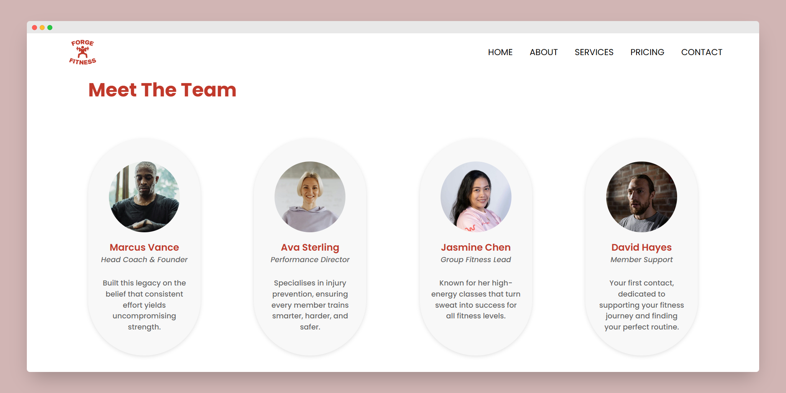
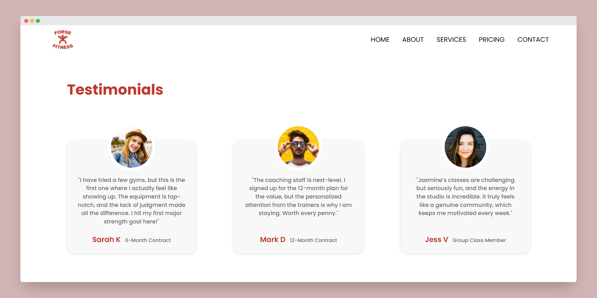
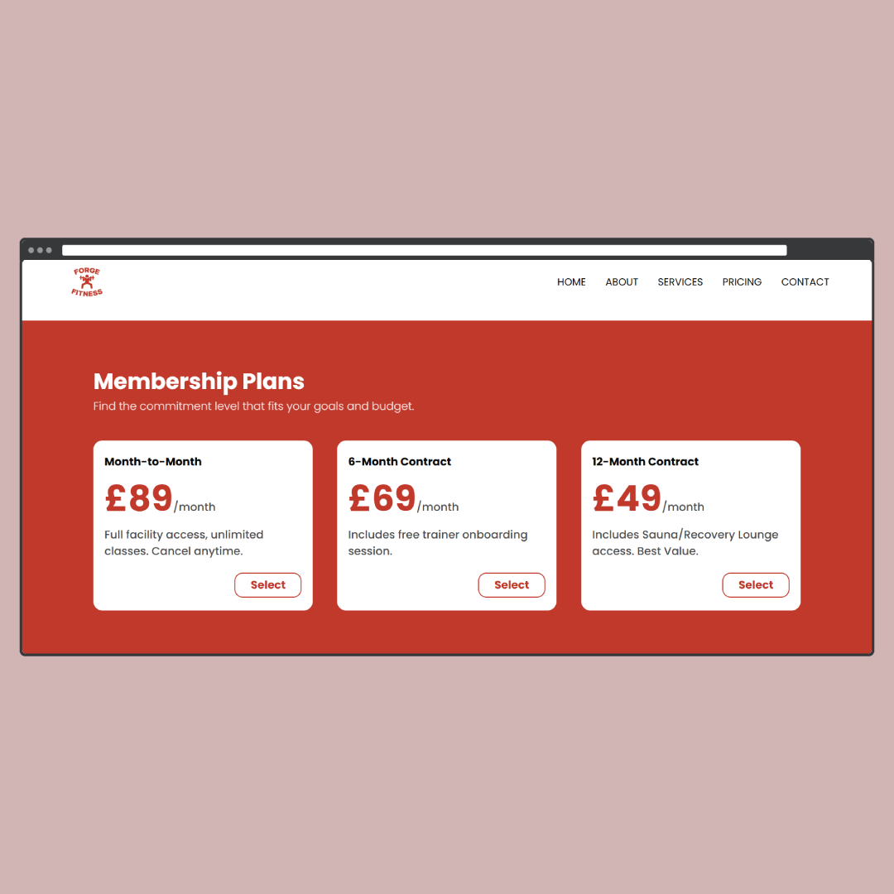
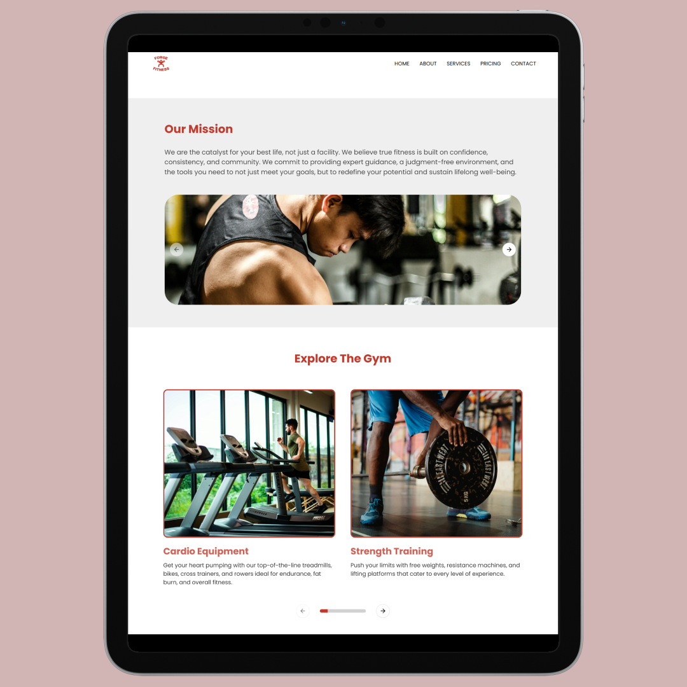
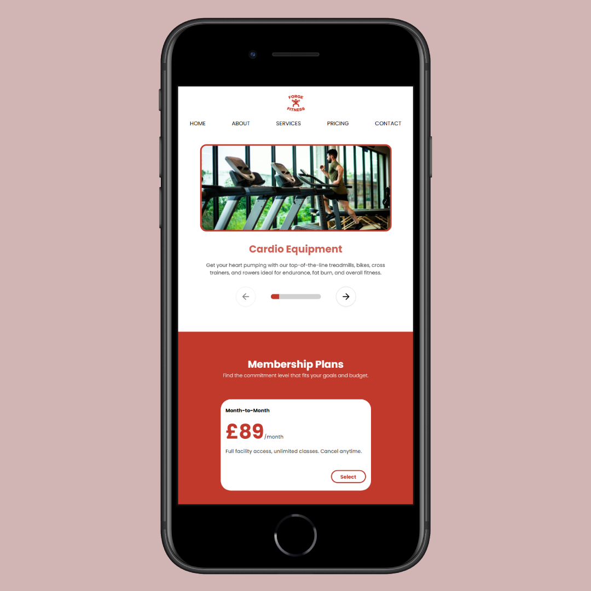

# Forge Fitness

<table>
  <tr>
    <td width="200">
      
    </td>
    <td>
      <p>
        <b>Forge Fitness</b> is a frontend built with React for a fully responsive mock gym website.  
          It features multiple sections including the Hero, Why Join Us, Our Mission, Membership Plans, Meet the Team, and Testimonials.  
          The design is clean, interactive, and adapts across desktop, tablet, and mobile devices.
      </p>
    </td>
  </tr>
</table>

---

## Live Site

Check out the site here:  
https://fitforge-site.vercel.app/

---

## 🖼️ Screenshots

### Main Sections
<table>
  <tr>
    <th>Hero Section</th>
    <th>Mission</th>
  </tr>
  <tr>
    <td></td>
    <td></td>
  </tr>

  <tr>
    <th>Explore</th>
    <th>Membership Plans</th>
  </tr>
  <tr>
    <td></td>
    <td></td>
  </tr>

  <tr>
    <th>Meet the Team</th>
    <th>Testimonials</th>
  </tr>
  <tr>
    <td></td>
    <td></td>
  </tr>
</table>

### Responsive Views
 <table>
  <tr>
    <th align="center">Desktop View</th>
    <th align="center">Tablet View</th>
    <th align="center">Phone View</th>
  </tr>
  <tr>
    <td align="center">
      
    </td>
    <td align="center">
      
    </td>
    <td align="center">
      
    </td>
  </tr>
</table>

---


## ⚙️ Tech Stack

- **React.js + Vite** - Frontend framework and setup  
- **TailwindCSS** - Styling with responsive design and utility classes  
- **HTML5 & CSS3** - Structure and custom styles
- **shadcn/ui** - Used for interactive components like **carousels** and **separators**
- **AOS (Animate On Scroll)** - Scroll-triggered animations 

---


## Setup Guide

1. Clone the repo:
   
   ```bash
   git clone https://github.com/AntoOfo/fitforge-site
   cd fitforge-site
    ```
2. Install dependencies:
   
   ```bash
   npm install
    ```
   
4. Run the site locally:
   ```bash
   npm run dev
    ```

---

## 📁 License

Licensed under the MIT License.
